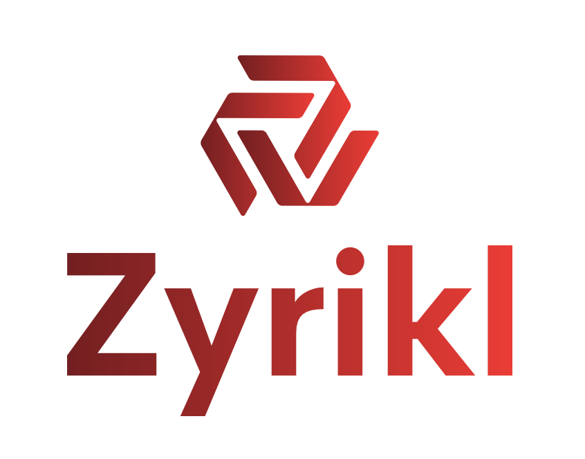

# This is Zyrikl.
This is a project created by Charles Wang.



Zyrikl is a programming language designed to make HTML look hard. Yup, that's right! No more wrapping tags and over-excessive use of "<" and ">", just plain old keywords. With easy syntax like `echo "Hello, World";`, you can easily add content to your website.

> ## So, how do I start with Zyrikl?

It's easy! Just paste the following HTML code in:
```
<zyrikl>
// Insert Zyrikl here:
</zyrikl>
<script src="https://raw.githubusercontent.com/zyrikl/zyrikl/refs/heads/main/source.js"></script>
```
> ## Where do I learn Zyrikl?

Follow the instructions at https://zyrikl.github.io/zyrikl/learn.
